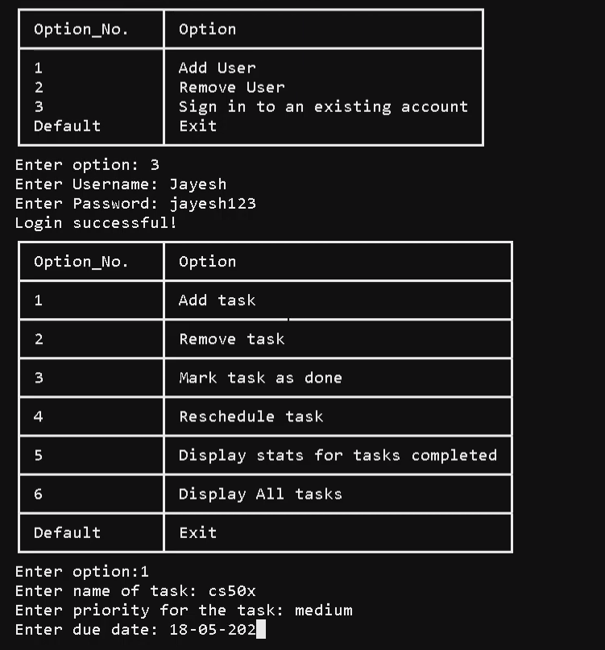

# Authenticator and Task Manager!

>Video Demo:  [link](https://youtu.be/J-bWzcZcBO4?si=1lB0jlfBU8F8G8tv)

## Preview 



## Description:

**Program Description**

The provided Python program is a task management system that allows users to create, manage, and track their tasks. It uses SQLite for data storage and manipulation, and incorporates a command-line interface for interaction. Below is a detailed description of the program's key components and functionalities:

1. **Libraries Used:**
   - `tabulate`: This library is used for formatting data in tabular form, making it easier for users to read and interact with the tasks.

2. **Classes:**
   - `task_manager`: This class represents a user's task management system. It contains methods for adding, removing, rescheduling, and marking tasks as done. It also provides statistics on the user's tasks.

3. **Attributes of `task_manager`:**
   - `name` and `password`: These attributes represent the username and password associated with the user's task manager.
   - `tasks`: This is a list of dictionaries, where each dictionary represents a task. Each task contains information about the task name, priority, and due date.
   - `completed_tasks` and `pending_tasks`: These attributes keep track of the number of completed and pending tasks respectively.
   - `db_file_name`: This attribute holds the name of the SQLite database file associated with the user.

4. **Methods of `task_manager`:**
   - `__init__(self, name, password)`: Initializes a new instance of `task_manager`. It checks if a database file for the user already exists and loads tasks if available.
   - `__str__(self)`: Returns a formatted string representation of the tasks, sorted by priority.
   - `add_task(self, task)`: Adds a new task to the user's task list and updates the database.
   - `remove_task(self, task_name)`: Removes a task from the user's task list and updates the database.
   - `reschedule_task(self, task_name, new_due_date)`: Updates the due date of a task and modifies the database accordingly.
   - `mark_as_done(self, task)`: Marks a task as done, updates task counts, and removes it from the task list.
   - `stats`: Provides statistics on the user's tasks, including the number of completed and pending tasks.

5. **Global Variables:**
   - `users`: A list to store user information.
   - `classes`: A dictionary that maps usernames to their respective `task_manager` instances.
   - `current_user`: A string representing the currently logged-in user.

6. **Authentication and User Management:**
   - `authenticator()`: Authenticates a user by verifying their username and password against the stored information in the database.
   - `option_menu_user()`: Displays the menu for user-related operations and returns the chosen option.
   - `add_user()`: Adds a new user, creates a corresponding `task_manager` instance, and stores the user's information in the database.
   - `remove_user()`: Removes a user, deletes their database file, and updates the user list.

7. **Task Management:**
   - `option_menu_task_manager()`: Displays the menu for task-related operations and returns the chosen option.
   - Methods like `add_task()`, `remove_task()`, `mark_as_done()`, `reschedule_task()`, `display_stats()`, and `display_all_tasks()` perform various task management operations.

8. **Unused Functions:**
   - `unused_fun(i)`: A placeholder function.
   - `unused_fun1(j)`: Another placeholder function.

9. **Execution:**
   - The program's main entry point is the `main()` function. It initiates the user interaction by presenting options for creating a new user, removing a user, or signing in to an existing account.

10. **Error Handling:**
    - The program includes basic error handling for incorrect inputs (e.g., ValueError) and password validation.

11. **Database Handling:**
    - The program uses SQLite to create and manage databases for users and their respective tasks.

12. **Exiting the Program:**
    - If an invalid option is selected, the program exits with a message thanking the user for visiting.

Overall, this program provides a flexible and organized platform for users to manage their tasks efficiently, with persistent data storage using SQLite. It employs a command-line interface, making it accessible and easy to use for a wide range of users.

### Features of Authenticator:

```
1. Add user
2. Remove user
3. Login to existing account
```

### Features of task manager:

```
1. Add task
2. Remove task
3. Reschedule task
4. Mark task as done
5. Display every task
6. Display stats for tasks completed and tasks pending
```